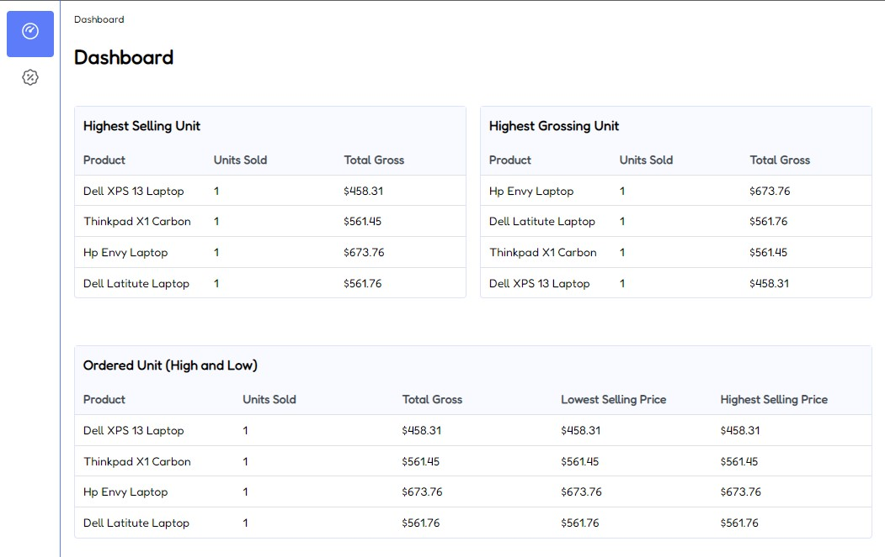

Welcome to the monorepo for PhloSales

## Contents
This repository is a monorepo containing four projects
- [**src/nginx**](https://github.com/dotfelixb/phlosales/tree/main/src/nginx) is a reverse proxy serving as an api gateway, phlosales.web depends on it
- [**src/phlosales.auth**](https://github.com/dotfelixb/phlosales/tree/main/src/PhloSales.Auth) contains the source for authentication, authorization and token generation
- [**src/phlosales.server**](https://github.com/dotfelixb/phlosales/tree/main/src/PhloSales.Server) contains the source for sales order
- [**src/phlosales.web**](https://github.com/dotfelixb/phlosales/tree/main/src/phlosales.web) contains the source for a react spa frontend for sales order

### misc:
- [**src/phlosales.core**](https://github.com/dotfelixb/phlosales/tree/main/src/PhloSales.Core) contains the source for common operation between all services except data and web
- [**src/phlosales.data**](https://github.com/dotfelixb/phlosales/tree/main/src/PhloSales.Data) contains the source for data interaction

## Deployment
Download and install [**docker desktop**](https://www.docker.com/products/docker-desktop/) for windows or macos (linux need extra attention), recent version of `docker desktop` installation comes with `docker-compose` as `docker compose` added to your path

Clone and run project with the command below
```
git clone https://github.com/dotfelixb/phlosales.git
cd phlosales

docker compose -f desktop-compose.yml up 
```
`docker compose` might need to download extra images and packages, after `docker compose` is done point your browser to [phlosales web](http://localhost:3000), alternatively you can open docker desktop ui and open on the phlosales web container in your browser
```
http://localhost:3000
```
This will bring up the react app which redirect users to `/login` to authenticate

The project contains one `login` user for testing
```
username: admin@phlosales.com
password: 1433P@$$
```

Login screen
<div style="text-align: center; transform: scale(.95);">
  
</div>

Home screen
<div style="text-align: center; transform: scale(.95);">
  
</div>

Sales Order screen
<div style="text-align: center; transform: scale(.95);">
  
</div>

### New Sales Order screen

User's can create new sales order from this screen, the table control allows the user
select a customer from a dropdown list of customer or create a user customer, also user
can select a product or create a new product
User can use the plus button under the submit botton to add new row to the order table,
when done user click the submit button to confirm saving the order which is posted to the backend.
below is a screenshot of the New Sales Order UI
<div style="text-align: center; transform: scale(.95);">
  
</div>

### New Customer
New customer can be created when adding a new sales order, a user can type a customer's name to search on the customer dropdown, but if the customer is not found the UI display the option for the user to create a new customer, the UI to perform this action is displayed below
<div style="text-align: center; transform: scale(.95);">
  
</div>

### New Product 
User's can also create new product if not in the dropdown as shown below
<div style="text-align: center; transform: scale(.95);">
  
</div>

